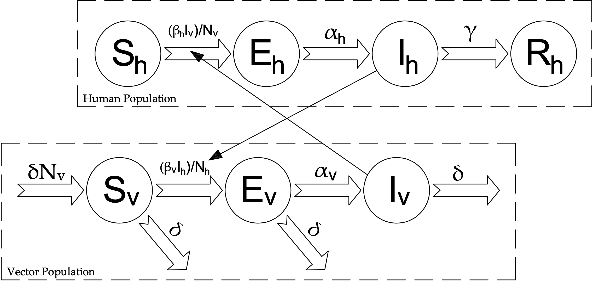

# Zika Virus Dynamics

**ZikaVD** is an easy to run Matlab code to simulate the nonlinear dynamics of the Zika virus. The implementation follows an educational style, to make its use very intuitive. This package includes the following modules:

main_SEIR_SEI.m - 

rhs_SEIR_SEI.m - 

TRR_main_SEIR_SEI.m - 

rhs_SEIR_SEI.m - 

TRR_rhs_SEIR_SEI.m - 

TRR_FunctionOutput_SEIR_SEI.m - 

Further details about can be seen in:

*E. Dantas, M. Tosin, A. Cunha Jr, Calibration of a SEIR–SEI epidemic model to describe the Zika virus outbreak in Brazil,  Applied Mathematics and Computation, vol. 338, pp. 249-259, 2018*
https://doi.org/10.1016/j.amc.2018.06.024

## Authors:
- Eber Dantas
- Michel Tosin
- Americo Cunha

## Citing ZikaVD:

We kindly ask users to cite the following reference in any publications reporting work done with **ZikaVD**:

*E. Dantas, M. Tosin, A. Cunha Jr, Calibration of a SEIR–SEI epidemic model to describe the Zika virus outbreak in Brazil,  Applied Mathematics and Computation, vol. 338, pp. 249-259, 2018*
https://doi.org/10.1016/j.amc.2018.06.024

## License

**ZikaVD** is released under the MIT license. See the LICENSE and NOTICE files for details. All new contributions must be made under the MIT license.
